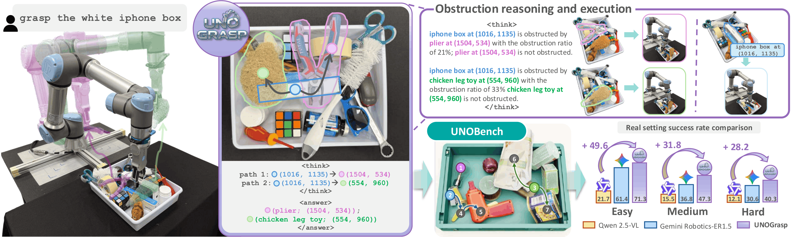
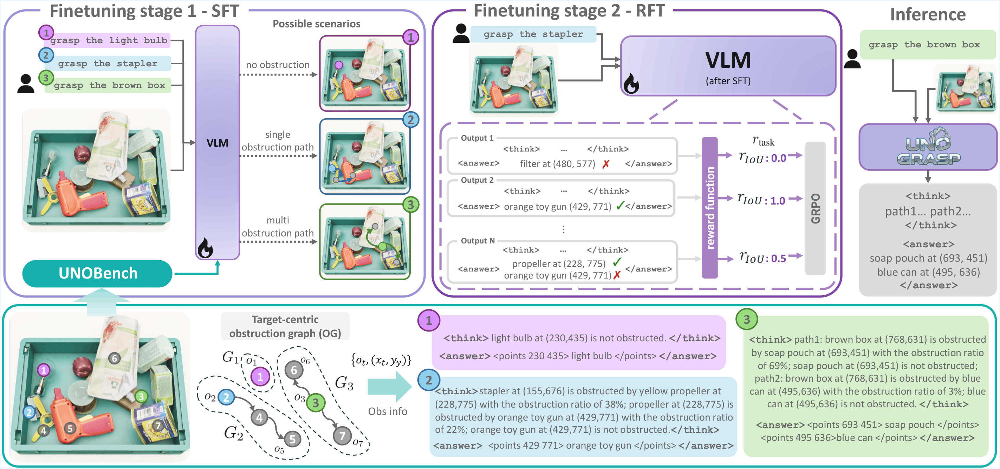
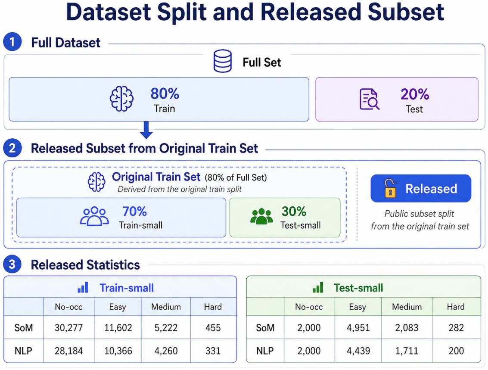
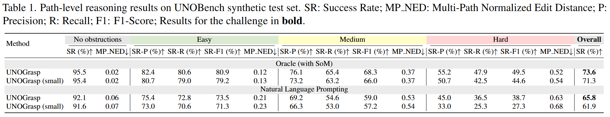

# UnoGrasp: Obstruction Reasoning for Robotic Grasping (CVPR 2026)

[](https://creativecommons.org/licenses/by-nc/4.0/)

<div style="border: 1px solid #d0d7de; border-radius: 8px; padding: 12px 16px; margin: 16px 0; background-color: #f6f8fa;">

## News

- **2026-05-31:** **UnoBench dataset is released.** Download it from [Here](https://huggingface.co/datasets/rjiao/UnoBench).
- **2026-05-31:** **Small subset checkpoints are released.** Download them from the [Here](https://huggingface.co/collections/rjiao/unograsp).

</div>

Official repository for **UnoGrasp: Obstruction Reasoning for Robotic Grasping**.

This release supports reproduction and example evaluation for the CVPR 2026 paper and ECCV 2026 Workshop Challenge. It includes inference scripts, evaluation scripts, released checkpoints for the UnoBench small split, and links to the released UnoBench dataset. Training code will be made available after the ECCV 2026 Challenge.

**Links:** [Project Page](https://tev-fbk.github.io/UnoGrasp/) | [Paper](https://arxiv.org/pdf/2511.23186) | [Video](https://www.youtube.com/watch?v=i2SRak0pS7M) | [Challenge](https://github.com/Ryan7180/UnoBench_Challenge) | [UnoBench Dataset](https://huggingface.co/datasets/rjiao/UnoBench)

<p align="center">
  
</p>

## Overview

UnoGrasp studies robotic grasp planning with occlusion reasoning. Given a single scene image and a language instruction, the model predicts whether the target object can be grasped directly or which object should be removed first.

The repository supports two reasoning settings:

- **SoM reasoning:** target and occluding objects are represented by object IDs.
- **NLP reasoning:** target and occluding objects are represented by natural-language object descriptions and image coordinates.

<p align="center">
  
</p>

## Contents

- [Installation](#installation)
- [Dataset](#dataset)
- [Checkpoints](#checkpoints)
- [Quick Start](#quick-start)
- [Inference](#inference)
- [Evaluation](#evaluation)
- [Results](#results)

## Installation

Create the Conda environment:

```bash
conda create -n unograsp python=3.10
conda activate unograsp
```

Install PyTorch following the official command for your CUDA version. This release was tested with:

```bash
pip install torch==2.6.0 torchvision==0.21.0 --index-url https://download.pytorch.org/whl/cu124
```

Install the build helpers needed by packages such as `flash_attn`, then install the remaining dependencies from the repository requirements file:

```bash
pip install packaging ninja psutil wheel
pip install -r requirement.txt --no-build-isolation
```

## Dataset

The current public release includes the synthetic benchmark only. Download [UnoBench](https://huggingface.co/datasets/rjiao/UnoBench) from Hugging Face and place the synthetic folder next to this repository as `UnoBench/UnoBenchSyn`:

```text
Uno_CVPR/
|-- UnoBench/
|   `-- UnoBenchSyn/
`-- UnoGrasp_open/
```

The files used by this repository are:

```text
../UnoBench/UnoBenchSyn/test_som_small.jsonl
../UnoBench/UnoBenchSyn/test_nlp_small.jsonl
../UnoBench/UnoBenchSyn/test_GT_small.json
../UnoBench/UnoBenchSyn/annotations/
```

The full dataset split used in the paper and the released synthetic split are shown below. The real-world set and paper test ground truth are not included in this public release.

<p align="center">
  
</p>

For internal comparisons, use the released synthetic small split. For official challenge evaluation, train on the released data and submit predictions to the challenge leaderboard when available.

## Checkpoints

Download the released Hugging Face checkpoints and place them under `checkpoints/`:

- [UnoGrasp-Ratio-RL-IoU-som-small](https://huggingface.co/rjiao/UnoGrasp-Ratio-RL-IoU-som-small)
- [UnoGrasp-Ratio-RL-IoU-nlp-small](https://huggingface.co/rjiao/UnoGrasp-Ratio-RL-IoU-nlp-small)

Expected layout:

```text
UnoGrasp_open/
`-- checkpoints/
    |-- UnoGrasp-Ratio-RL-IoU-som-small/
    `-- UnoGrasp-Ratio-RL-IoU-nlp-small/
```

## Quick Start

Run SoM inference and evaluation on the synthetic small split:

```bash
python unograsp/inference/infer_som.py \
  --model_path checkpoints/UnoGrasp-Ratio-RL-IoU-som-small \
  --dataset_json ../UnoBench/UnoBenchSyn/test_som_small.jsonl \
  --dataset_root ../UnoBench/UnoBenchSyn \
  --out_dir outputs/inference/som_synthetic \
  --device cuda:0 \
  --max_new_tokens 1500

python unograsp/evaluation/evaluate_som.py \
  --pred_path outputs/inference/som_synthetic/predictions.jsonl \
  --gt_path ../UnoBench/UnoBenchSyn/test_GT_small.json
```

Inference outputs are saved as `predictions.jsonl` inside the selected output directory. If this file already exists, inference resumes from unfinished samples.

## Inference

### SoM Reasoning

```bash
python unograsp/inference/infer_som.py \
  --model_path checkpoints/UnoGrasp-Ratio-RL-IoU-som-small \
  --dataset_json ../UnoBench/UnoBenchSyn/test_som_small.jsonl \
  --dataset_root ../UnoBench/UnoBenchSyn \
  --out_dir outputs/inference/som_synthetic \
  --device cuda:0 \
  --max_new_tokens 1500
```

### NLP Reasoning

```bash
python unograsp/inference/infer_nlp.py \
  --model_path checkpoints/UnoGrasp-Ratio-RL-IoU-nlp-small \
  --dataset_json ../UnoBench/UnoBenchSyn/test_nlp_small.jsonl \
  --dataset_root ../UnoBench/UnoBenchSyn \
  --out_dir outputs/inference/nlp_synthetic \
  --max_new_tokens 1500
```

## Evaluation

### SoM Evaluation

```bash
python unograsp/evaluation/evaluate_som.py \
  --pred_path outputs/inference/som_synthetic/predictions.jsonl \
  --gt_path ../UnoBench/UnoBenchSyn/test_GT_small.json
```

### NLP Evaluation

```bash
python unograsp/evaluation/evaluate_nlp.py \
  --pred_path outputs/inference/nlp_synthetic/predictions.jsonl \
  --gt_path ../UnoBench/UnoBenchSyn/test_GT_small.json \
  --npz_root ../UnoBench/UnoBenchSyn/annotations \
  --dataset_type synthetic
```

The evaluation scripts report success-rate metrics, occlusion-reasoning metrics, and MP-NED by difficulty level.

## Results

UnoGrasp is trained and tested on the full set. UnoGrasp (small) is trained and tested on the small subset. Overall is the group-weighted average SR-F1 over No-Occ, Easy, Medium, and Hard, as used for the challenge.
<p align="center">
  
</p>

## Notes

- This repository is intended for reproduction with released checkpoints.
- The released small split is for reproduction and example usage; the challenge test ground truth is reserved.

## License

This repository is released under the **CC BY-NC 4.0 license**. It may be used for academic, non-commercial purposes only. Commercial and military usage are not permitted. See the [license terms](https://creativecommons.org/licenses/by-nc/4.0/) for details.

## Citation

If you find this repository useful, please cite:

```bibtex
@article{jiao2025obstruction,
  title = {Obstruction reasoning for robotic grasping},
  author = {Runyu Jiao and Matteo Bortolon and Francesco Giuliari and Alice Fasoli and Sergio Povoli and Guofeng Mei and Yiming Wang and Fabio Poiesi},
  booktitle = {IEEE/CVF Conference on Computer Vision and Pattern Recognition (CVPR)},
  year = {2026}
}
```

```bibtex
@article{jiao2025free,
  title = {Free-form language-based robotic reasoning and grasping},
  author = {Jiao, Runyu and Fasoli, Alice and Giuliari, Francesco and Bortolon, Matteo and Povoli, Sergio and Mei, Guofeng and Wang, Yiming and Poiesi, Fabio},
  journal = {IEEE/RSJ International Conference on Intelligent Robots and Systems (IROS)},
  year = {2025}
}
```

## Contact

For questions, please contact `rjiao@fbk.eu`.
